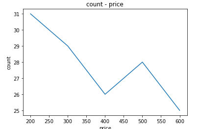

# Python入門
## Pythonとは
PythonはWeb、組み込み、ゲームを始め、近年では機械学習の分野で注目されているプログラミング言語です。
インデントでスコープを表現したり、コード量が比較的少なくて済むので、シンプルにプログラムを書くことができます。

## 基本文法
### Hello Python
print関数を使って画面に文字を出力します。
```python
print("Hello Python")
```
実行結果
```python
Hello Python
```

### 変数
Pythonの基本的なデータ型にはstr(文字列)、int(数値)、float(実数)、bool(真偽値型)、None型(他の言語でのnull)があります。
変数を宣言するときに型の宣言は特に必要ではありません。
変数を宣言して、値と型を確認しましょう。   
型の判別にはtype関数を使います。
```python
name = "Bob"
age = 20
height = 170.1
license = True # False
money = None

# 値の確認
# 型の確認
print(name)
print(type(name))
print(age)
print(type(age))
print(height)
print(type(height))
print(license)
print(type(license))
print(money)
print(type(money))
```
実行結果
```python
Bob
<class 'str'>
20
<class 'int'>
170.1
<class 'float'>
True
<class 'bool'>
None
<class 'NoneType'>
```
> Pythonでは#を使うとコメントを記述できます。

### if文
以下がif文のサンプルになります。スコープを表現するのインデントを使います。
ageとlicenseを判定して文字を出力します。
```python
name = "Bob"
age = 20
license = True

if age >= 20 and license:　# age >= 20 がTrue かつ license がTrue
    print("OK {}".format(name))
else: # 上記の条件以外の時
    print("NG")
```
> str.formatを使うと、指定したフォーマットの{}の中に文字を入れられます。  
   
実行結果
```python
OK Bob
```

### for文
for文を使って繰り返し構造を定義できます。指定回数繰り返すにはrange関数を使います。
> range([start,] stop[, step])
```python
print("--0から3まで繰り返す--")
for i in range(3):
    print(i)
print("--1から3まで繰り返す--")
for i in range(1, 3):
    print(i)
print("--3から1まで繰り返す--")
for i in range(3, 1, -1):
    print(i)
```
実行結果
```
--0から3まで繰り返す--
0
1
2
--1から3まで繰り返す--
1
2
--3から1まで繰り返す--
3
2
```
### リスト・タプル
Pythonでは　[]でリスト(配列)を、()でタプルを生成します。  
```python
# リスト作成
dogs = ["Poodle", "Dachsｈund", "Chihuahua", "Shiba"]
# タプル作成
cats = ("Munchkin", "Scottish Fold", "American Shorthair")

print("dogsの3番目 : {}".format(dogs[3]))
print("catsの0番目 : {}".format(cats[0]))

print("犬の種類")
for dog in dogs:
    print(dog)
print("猫の種類")
for cat in cats:
    print(cat)
```
実行結果
```python
dogsの3番目 : Shiba
catsの0番目 : Munchkin
犬の種類
Poodle
Dachsｈund
Chihuahua
Shiba
猫の種類
Munchkin
Scottish Fold
American Shorthair
```

リストは後から中身を変更できますが、タプルは変更できません。   
```python
# リスト作成
dogs = ["Poodle", "Dachsｈund", "Chihuahua", "Shiba"]
# タプル作成
cats = ("Munchkin", "Scottish Fold", "American Shorthair")

dogs.append("Pug")
dogs[0] = "Maltese"
dogs.remove("Dachsｈund")
dogs.reverse()
# タプルを変更しようとするとエラーになる
# cats.append("Bengal")
print(dogs)
```
実行結果
```python
# for文で回さなくてもこんな感じで表示できる
['Pug', 'Shiba', 'Chihuahua', 'Maltese']
```
> リストの方ができることが多くて便利ですが、内容に変更がないことが決まっているならタプルを使う方が実行速度が速くなるなどのメリットがあります。

### ディクショナリ
{}を使うことでディクショナリを宣言できます。ディクショナリを宣言することでkeyとvalueをマッピングできます。
ディクショナリをfor文で回すとkeyが取れ、dictionary[key]でvalueが取れます。
```python
dogs = {'Pug':'Pochi', 'Shiba':'Mame', 'Chihuahua':'John', 'Maltese':'Shiro'}
for dog in dogs:
    print(dog, dogs[dog])
```
出力結果
```python
Pug Pochi
Shiba Mame
Chihuahua John
Maltese Shiro
```

### 関数
Pythonではdefキーワードを使って関数を定義できます。
繰り返し利用する処理や長いコードは関数としてまとめると便利になります。
```python
# 足し算をする関数
def sum(x, y):
    result = x + y
    return result

# 関数を定義することで引数 x, yを変えるだけで処理ができる
print(sum(1, 2))
print(sum(10, 5))
```
実行結果
```python
3
15
```

### クラスとインスタンス
数値、文字列、リスト、タプル、辞書など、Pythonのデータは全てがクラスから作られたオブジェクトです。クラスを定義することで独自のオブジェクトを作ることができます。   
クラスとはオブジェクトの設計書です。クラスから作ったオブジェクトのことをインスタンスと呼びます。
```python
class Dog:
    # インスタンスを生成するためのメソッド
    def __init__(self, name, energy):
        self.name = name
        self.energy = energy

    def bark(self):
        if self.energy > 0:
            self.energy = self.energy - 1
            print("{}: わんわん".format(self.name))
        else:
            print("{}: （おなかが空いているようだ...）".format(self.name))

# インスタンス生成
dog1 = Dog('Pochi', 3)
dog2 = Dog('Shiro', 4)

for i in range(5):
    dog1.bark()
    dog2.bark()

```
実行結果
```python
Pochi: わんわん
Shiro: わんわん
Pochi: わんわん
Shiro: わんわん
Pochi: わんわん
Shiro: わんわん
Pochi: （おなかが空いているようだ...）
Shiro: わんわん
Pochi: （おなかが空いているようだ...）
Shiro: （おなかが空いているようだ...）
```

## numpy
NumPyライブラリの配列はPython標準のリストよりも効率的に多次元配列を扱うことができ、高速な行列計算が行えます。そういった経緯から機械学習や科学計算で活用されることが多いです。
```python
import numpy as np
line1 = [10, 20, 30]
line2 = [40, 50, 60]
line3 = [70, 80, 90]

#a = np.arange(10, 100, 10).reshape(3, 3) #同じ結果
a = np.array([line1, line2, line3])
print(a)
```
実行結果
```python
[[10 20 30]
 [40 50 60]
 [70 80 90]]
```
> arange([start,] stop[, step])       
numpyを使うと多次元配列の扱いが楽になります。
```python
import numpy as np
line1 = [10, 20, 30, 40]
line2 = [50, 60, 70, 80]
line3 = [90, 100, 110, 120]

a = np.array([line1, line2, line3])
print(a)
#多次元→1次元配列に変更
b = a.ravel()
print(b)

#1次元→多次元へ変更
c = b.reshape(6, 2)
print(c)
```
実行結果
```python
[[ 10  20  30  40]
 [ 50  60  70  80]
 [ 90 100 110 120]]
[ 10  20  30  40  50  60  70  80  90 100 110 120]
[[ 10  20]
 [ 30  40]
 [ 50  60]
 [ 70  80]
 [ 90 100]
 [110 120]]
```
### 配列の演算
NumPy配列の演算はブロードキャストと呼ばれる機能により、行列に数値演算を行ったり、形の違う行列同士を演算できます。
```python
import numpy as np
# numpy配列生成
a = np.array([10, 20, 30, 40]).reshape(2, 2)
print(a)

#配列と数値
b = a + 5
# 全ての要素に5足される
print(b)

c = np.array([1, 2])
d = np.array([1, 2]).reshape(2, 1)
#配列と配列
print(a + b)
print(a + c) # [10 + 1, 20 + 2] [30 + 1, 40 + 2]
print(a + d) #[10 + 1, 20 + 1] [30 + 2, 40 + 2]
# e = np.array([1, 2, 3, 4, 5])
#print(a + e) #行数か列数どちらかが同じでないとエラーになる
```
実行結果
```python
[[10 20]
 [30 40]]
[[15 25]
 [35 45]]
[[25 45]
 [65 85]]
[[11 22]
 [31 42]]
[[11 21]
 [32 42]]
```
numpyには様々な関数が用意されています。
```python
import numpy as np
a = np.array([[1, 2], [3, 4]])
print(a.sum()) #合計
print(a.max()) #最大値
print(a.min(0)) #最小値
print(a.mean(1)) #平均

b = np.array([[5, 6], [7, 8]])
# 内積
c = np.dot(a, b)
print(c)
# 外積
d = np.cross(a, b)
print(d)
```
実行結果
```python
10
4
[1 2]
[ 1.5  3.5]
[[19 22]
 [43 50]]
[-4 -4]
```
> sum(),max(),min(),mean()に関しては引数に0か1を与えることで行ごと、列ごとの結果を出せます
## matplotlib
Matplotlibパッケージを利用すると様々なグラフを描画できます。
折れ線グラフは以下のように実装します。
```python
import matplotlib.pyplot as plt
x = [2., 2.1, 3.5, 1.1, 4.3, 3.2, 5.3]
plt.plot(x)
plt.show()

# x軸とy軸両方セットすることもできる
price = [200, 300, 400, 500, 600]
count = [31, 29, 26, 28, 25]
plt.plot(price, count)
plt.title("count - price") #タイトル
plt.xlabel("price") #x軸のラベル
plt.ylabel("count") #y軸のラベル
plt.show()
```
以下のようなグラフが表示されるはずです。



ヒストグラムを使用するときはplt.hist()を利用します。
   
```python
import numpy as np
import matplotlib.pyplot as plt

# numpyで作成したデータを表示する
x = np.random.normal(50, 10, 100)

plt.hist(x)
plt.show()
```
以下のようなグラフが生成されるはずです

    

